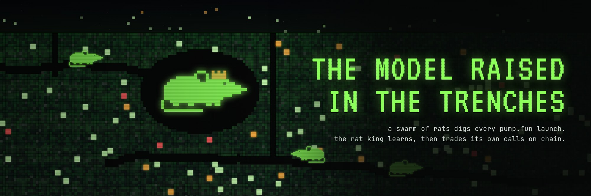
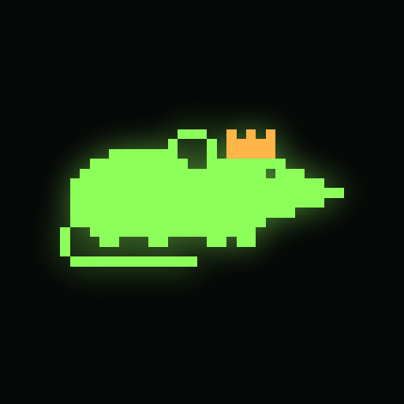
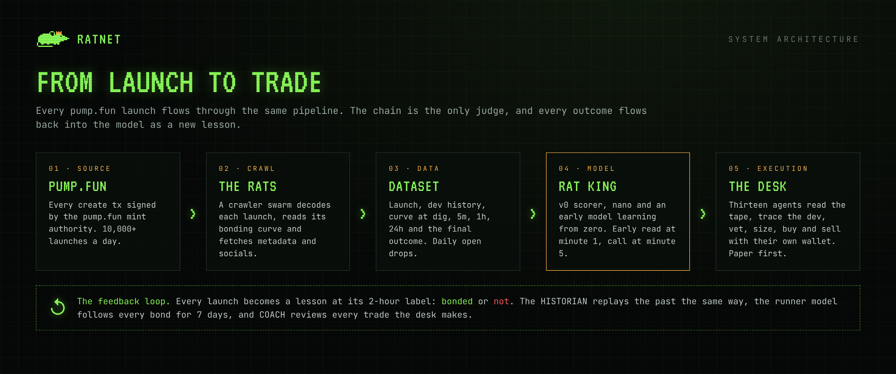
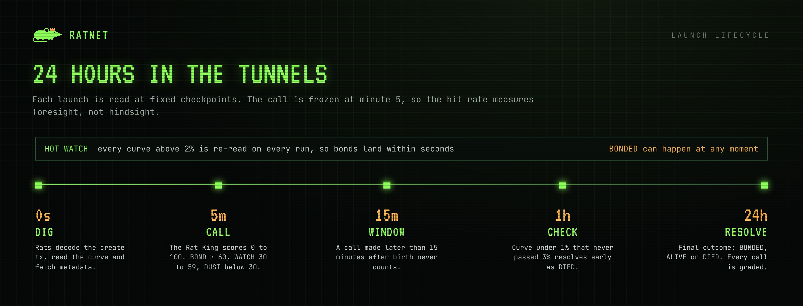
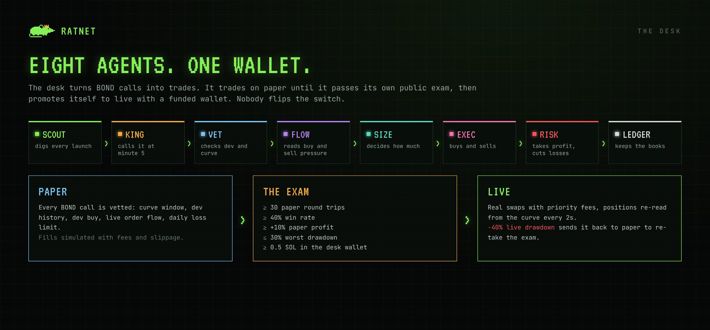
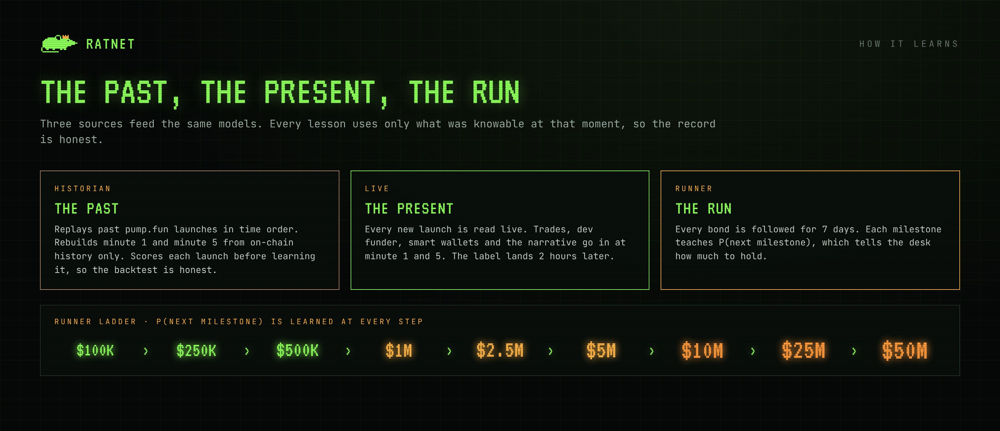
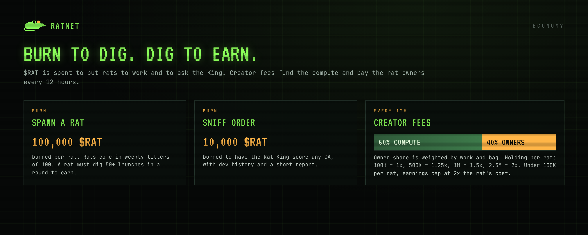
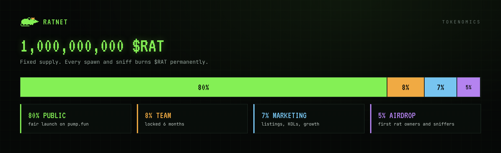

<p align="center">
  
</p>

<p align="center">
  
</p>

<h1 align="center">RATNET</h1>

<p align="center">
  <b>Pretraining the first model on the trenches.</b><br>
  A swarm of rats digs every pump.fun launch, the Rat King learns, then trades its own calls on chain.
</p>

<p align="center">
  
  
  
  
  
</p>

<p align="center">
  <a href="https://www.ratnet.network">www.ratnet.network</a> ·
  <a href="https://x.com/Ratnetdev">X @Ratnetdev</a> ·
  <a href="#8-the-desk-autonomous-trading">Desk</a> ·
  <a href="#6-the-rat-king-models">Rat King</a> ·
  <a href="#8b-how-it-learns-past-present-run">How it learns</a> ·
  <a href="#12-open-api">API</a> ·
  <a href="#11-the-open-dataset">Dataset</a>
</p>

---

## Contents

1. [Overview](#1-overview)
2. [Why RATNET](#2-why-ratnet)
3. [System architecture](#3-system-architecture)
4. [The rats: data acquisition](#4-the-rats-data-acquisition)
5. [Launch lifecycle and outcomes](#5-launch-lifecycle-and-outcomes)
6. [The Rat King: models](#6-the-rat-king-models)
7. [Measuring the King in public](#7-measuring-the-king-in-public)
8. [The Desk: autonomous trading](#8-the-desk-autonomous-trading)
8b. [How it learns: past, present, run](#8b-how-it-learns-past-present-run)
9. [Economy: rats, sniffs and rounds](#9-economy-rats-sniffs-and-rounds)
10. [Tokenomics](#10-tokenomics)
11. [The open dataset](#11-the-open-dataset)
12. [Open API](#12-open-api)
13. [Product surfaces](#13-product-surfaces)
14. [Roadmap](#14-roadmap)
15. [Self-hosting](#15-self-hosting)
16. [Repository layout](#16-repository-layout)
17. [Security and transparency](#17-security-and-transparency)
18. [Research behind the design](#18-research-behind-the-design)

---

## 1. Overview

RATNET is pretraining the first model native to the trenches.

A swarm of crawler **rats** indexes every pump.fun launch in real time: metadata, socials, dev history, bonding curve flow and the final outcome. Everything goes into a live, open dataset.

The **Rat King** is a model trained from scratch on that dataset alone. It scores each launch at minute 5 on one target: **will this coin bond?** Every call is frozen the moment it is made, then graded by the chain. Hits and misses stay on the board forever.

The **Desk** is an autonomous team of seventeen agents that turns the King's calls into trades with its own wallet, on chain, in public. It reads every trade on the curve, traces who funded the dev, recognises smart wallets, never chases, takes its cost back at 2x and lets the rest run with a trail that widens as the coin climbs. It trades on paper until it passes its own exam, then promotes itself to live. Nobody flips the switch.

The **HISTORIAN** replays pump.fun's past, launch by launch and in time order, so the models start trained instead of waiting weeks for live data. Every bond is then followed for 7 days, so the King learns not just which coins bond, but which ones run to $1M, $10M and beyond.

> Other agents talk about markets. RATNET learns from them and trades them.

---

## 2. Why RATNET

**The trenches are the largest unlabelled dataset in crypto.** pump.fun produces 10,000+ new tokens a day. Around one percent of them complete their bonding curve. Every one of them is a fully observable experiment: who launched it, how it was presented, how the curve filled, and how it ended. Nobody is learning from all of it.

**AI agents in crypto cannot be checked.** Most agents produce opinions, threads and vibes. There is no target, no score and no record. You cannot tell a good one from a lucky one.

RATNET is built around three rules:

| Rule | What it means |
|---|---|
| **One target** | Every launch is scored on a single, binary question: will it bond. The chain answers it. |
| **No hindsight** | The call is made at minute 5 and frozen. A call made later than 15 minutes after birth never counts. |
| **Everything public** | Hit rate, base rate, calibration, model weights, loss curve, trades and the dataset itself. |

The data never runs out. Every new launch is a new training sample, so the King gets one lesson richer every few seconds, around the clock.

---

## 3. System architecture

<p align="center">
  
</p>

| Layer | Component | Responsibility |
|---|---|---|
| Source | pump.fun program | Every launch is signed by the pump.fun mint authority, so its signature history is a clean stream of new tokens. |
| Crawl | The rats (`src/lib/digger.ts`, `src/lib/solana.ts`) | Decode create transactions, read bonding curves, fetch off-chain metadata, track checkpoints and resolve outcomes. |
| Data | Upstash Redis + Vercel Blob | Hot state, sorted watch sets, 24h coin index, resolved rows and daily JSONL drops. |
| Model | Rat King v0 + nano (`src/lib/king.ts`, `src/lib/nano.ts`) | Score every launch at minute 5. Nano learns online from every resolved launch. |
| Reads | TAPE, GRAPH, META, BUZZ (`tape.ts`, `graph.ts`, `meta.ts`, `buzz.ts`) | Trades on the curve, bundles, snipers, dev sells; dev funder cluster and smart wallets; hot narrative and copycats; X mentions and paid dex signals. |
| History | HISTORIAN (`src/lib/historian.ts`) | Replays past launches in time order and trains every model on them, with no look-ahead. |
| Runs | Runner model (`src/lib/runner.ts`) | Follows every bond for 7 days and learns P(next market cap milestone). |
| Execution | The Desk (`src/lib/desk.ts`) | Vet, size, buy, manage and sell positions. Shadow entries, COACH exit reviews. Paper or live. |
| Interface | Next.js 14 app + open API | Live feed, radar, explore, desk, lab, coin pages, share cards. |

One scheduled ping per minute drives the whole system. Each ping opens a ~55 second session in which the desk re-reads open positions every 2 seconds and the rats dig every 10 seconds.

---

## 4. The rats: data acquisition

The rats watch the pump.fun mint authority `TSLvdd1pWpHVjahSpsvCXUbgwsL3JAcvokwaKt1eokM`. Every pump.fun create transaction is signed by it, so reading its signature history yields every new launch without scanning the whole program.

For each launch the rats:

1. **Decode** the `create` or `create_v2` instruction: mint, name, ticker, metadata URI, creator and the dev's initial buy.
2. **Read** the bonding curve account: virtual and real reserves, completion flag, quote mint. Curve progress, market cap and price are derived on chain, not from third parties.
3. **Fetch** off-chain metadata: description, X, Telegram and website links.
4. **Remember** the dev: every creator's past launches and past bonds are stored, so a serial launcher is recognised on sight.
5. **Schedule** checkpoints and add the coin to the watch sets.

**Hot watch.** Every curve above 2% is re-read on every run (the top 200 by curve plus a rotating slice of the rest). Graduations are detected within seconds instead of at the next checkpoint. The watch reads only curve accounts and two sorted sets, so it stays cheap at full pump.fun volume.

**Graduation proof.** A full curve is not a graduation. A coin counts as BONDED only when it sits in its canonical PumpSwap pool: the pool address only pump.fun's own migration can create (seeds `pool-authority` + `pool` from the official pump SDK), holding the migrated curve. Curves that complete but never migrate are resolved as not bonded after 30 minutes and never teach the models anything. Side pools anyone can open (often holding a few dollars) are ignored everywhere.

**Market caps from the chain.** Coins on the curve: price from the curve account. Graduated coins: price from the canonical pool's two vaults, one RPC call for up to 50 coins. DexScreener is only used for volume and buy/sell flow, never for the market cap, so post-bond peaks are exact and instant.

**RPC budget.** The desk, the rats and the historian share one rate limiter (`RPC_RPS`). The desk and the dig always go first; the historian only uses spare capacity. A rate-limit answer slows everyone down and retries instead of failing.

**TAPE (trades).** For every coin moving at its read (curve 5%+ at minute 5, 3%+ at minute 1) the rats read the curve's transactions: trade count and speed, unique traders, SOL per buy, buy share, bundle wallets in the create slot, snipers in the next two slots, top-5 early concentration and whether the dev has sold. The token accounts of the dev, bundle wallets, snipers and top buyers are kept, so the desk can watch those bags while it holds.

**GRAPH (wallets).** The dev wallet is traced to the wallet that first funded it. Launches are grouped by that funder, so a factory that launches hundreds of coins from fresh wallets is recognised on sight, and so is a team that ships winners. Every early buyer is put on record: wallets that keep getting in early on coins that bond or reach $1M become smart wallets, learned from scratch out of RATNET's own data.

**META (narrative).** Words in names and tickers are counted against what is bonding right now, so a launch riding the hot meta is flagged, and a copy of a coin that just bonded is flagged too (copies graduate at about a tenth of the rate of originals).

**Market data.** Market cap, volume, price change, liquidity and buy/sell counts come from DexScreener, cached for 30 seconds and shown next to the on-chain curve data.

**Simulation.** `sim/run.ts` replays hours of synthetic pump.fun traffic through the real engine with a mock RPC and an in-memory Redis. A 30 hour run at ~21,000 launches a day caught every bond with an average lag of 9 seconds and zero errors.

---

## 5. Launch lifecycle and outcomes

<p align="center">
  
</p>

| Checkpoint | Time after birth | What happens |
|---|---|---|
| Dig | 0s | Launch decoded, curve read, metadata fetched, dev history attached. |
| Early read | 1m | TAPE and GRAPH read the coin; the minute-1 model makes its own call, tracked separately. |
| Call | 5m | Rat King v0 and nano score the launch. Features are frozen. |
| Window | 15m | Calls made after this point are marked late and never count toward the hit rate. |
| Check | 1h | Early death rule applied. |
| Lesson | 2h | The label is in (bonded within 2h or not). Every model learns this launch now. |
| Resolve | 24h | Final outcome recorded and the call is graded. |

| Outcome | Rule |
|---|---|
| **BONDED** | The bonding curve completed. Can happen at any moment and is caught by the hot watch. |
| **DIED** (early) | At the 1h check the curve is under 1% and its peak never passed 3%. |
| **DIED** | At 24h the curve is under 5%. |
| **ALIVE** | At 24h the curve is 5% or more but has not completed. |

The early death rule exists so the model sees losers as fast as it sees winners. Without it, the first day of training would contain almost only bonds.

---

## 6. The Rat King: models

The King runs two models side by side. Both score every launch at minute 5, and both are graded on the same board.

### Rat King v0: the transparent baseline

A hand-written scorer with every weight public. It exists to give the learned model something honest to beat.

| Signal | Max points |
|---|---|
| Curve filled at call (full points at 30%) | 45 |
| Curve growth since first dig (full points at +15%) | 15 |
| X link present | 8 |
| Website present | 6 |
| Description of 40+ characters | 5 |
| Dev buy between 0.5 and 5 SOL (over 5 SOL: 2 points) | 5 |
| Telegram present | 4 |
| Clean ticker (2 to 8 letters or digits) | 4 |
| Name of 24 characters or less, not a test | 3 |

The raw total (max 95) is normalised to 0 to 100.

| Verdict | Score |
|---|---|
| **BOND** | 60 and above |
| **WATCH** | 30 to 59 |
| **DUST** | below 30 |

### Rat King nano: learning from zero

Nano is a model trained from scratch, live, on nothing but what the rats dig. No pretrained weights and no outside data.

- **Model:** logistic regression trained online with SGD, one step per resolved launch.
- **Features (37):** bias, curve at 5m, curve climb since dig, dev buy (log SOL), X, Telegram, website, real description, clean ticker, short name, dev past launches (log), dev past bond rate, UTC hour (sin and cos), plus what TAPE, GRAPH and META read: trades read, trades per minute, unique traders, SOL per buy, buy share, bundle share, snipers, top-5 early share, dev already sold, smart wallets early, dev funder cluster edge, copy of a recent winner, same-ticker launches and hot meta lift, plus the farm signals (block-0 curve jump, organic traders, trades per trader, buy size spread, farm flag), the season (SOL 24h and 7d trend, pump.fun launch rate) and a flag for lessons replayed from history.
- **Faster learning:** every run replays a random slice of recent lessons at half weight, and when recent errors run 30% above the long-run average the market has shifted, so the learning rate rises 2.5x for the next 400 lessons.
- **One label window:** every launch is learned at its 2-hour mark as "bonded within 2h" or not. Winners bond in minutes while losers take a day to resolve; learning both at the same moment keeps the model from concluding that everything bonds.
- **Class balance:** bonds are rare, so they are weighted 8x. Otherwise the model would learn to say "dies" every time.
- **Regularisation:** L2 at 1e-4, learning rate 0.05.
- **Warm-up:** nano calls only count after 200 lessons.
- **An early twin:** the same model is trained on what the rats see at minute 1. Its calls are recorded on their own board, and the desk may act on them only once that record beats the minute-5 King.
- **Learns from what it missed:** coins that bond before the 5 minute call are still turned into lessons, so the King learns from the bonds it never got to call.
- **Public record, private weights:** sample count, loss log and the honest scoreboard are public at `/api/king/weights` and in the Lab; the weights themselves are admin only.

### Rat King v1: pretraining (roadmap)

A sequence model pretrained from scratch on the daily dataset drops. It runs next to v0 and nano on the same board, with a public loss curve and weights published on Hugging Face after the first epoch. See [Roadmap](#14-roadmap).

---

## 7. Measuring the King in public

Every number on the site is computed from frozen calls and on-chain outcomes.

| Metric | Definition |
|---|---|
| **BOND hit rate** | BOND calls that bonded ÷ all counted BOND calls. Pending calls count as misses until they resolve. |
| **Base rate** | Launches that bonded ÷ all launches dug. What random picking would get. |
| **Lift** | Hit rate ÷ base rate. How many times more often a King BOND call graduates than a random coin. |
| **Head start** | Average time between the King's BOND call and the actual graduation. |
| **Calibration** | Graduation rate per score bucket, for v0 and nano separately. |
| **Hourly hit rate** | Hit rate against base rate per hour over the last 24h. |
| **Runners** | Every coin followed after the call: market cap at the King's call, peak seen after bond, and the multiple between them. On graduations, coin pages and the Runners board. |
| **Backtest** | The HISTORIAN scores every past launch before learning it (prequential), so the historic hit rate is out of sample. |

| **Hall of fame** | The BOND calls that ran furthest from the market cap at the call, last 7 days. |
| **Why this call** | The strongest reasons for and against each call, from the same numbers the score used. |

Calls are never deleted, edited or re-scored. If the King is wrong, the board says so.

**On-chain receipts.** Every counted call goes into an hourly list (`mint,King verdict,score,nano verdict,score,call time`, one per line). Minutes after the hour ends, the SHA-256 of that list is written on-chain in a memo transaction: `RATNET calls <hour> n=<calls> sha256=<hash>`. Join the lines with a newline, hash them, compare with the memo. Same hash, same calls: nothing can be added, changed or deleted once the outcome is known. `/receipts` does the check in your browser.

---

## 8. The Desk: autonomous trading

<p align="center">
  
</p>

The Desk is a team of seventeen agents that turns calls and posts into trades and learns from every one. Every step each agent takes is logged and shown live on `/desk`, together with the balance chart, open positions (market cap, P(next milestone), trail, insider bags), the trade log, the full rule set and what the desk has learned.

| Agent | Role |
|---|---|
| HISTORIAN | Replays past launches to train the models. |
| SCOUT | Digs every launch; early read at minute 1. |
| KING | Calls it at minute 5. |
| TAPE | Reads every trade on the curve. |
| GRAPH | Traces the dev's funder and spots smart wallets. |
| VET | Checks dev, bundles, cluster, copycats, curve, that the trades were read, and that the coin holds its floor. |
| FLOW | Reads live buy and sell pressure. |
| BUZZ | X mentions of the CA (optional) and paid dex signals. Context, never a buy trigger alone. |
| SIZE | Small, equal bets, capped by the coin's liquidity (max 6% price impact on the curve), so a big desk never apes 10 SOL into a 5K coin. |
| EXEC | Buys and sells. |
| RISK | Initials, milestone ladder, trailing stop, insider exits. Holds through dev sells on memes (a prior COACH can overturn). |
| COACH | Reviews every exit and every entry, follows each coin 5m, 15m, 1h, 2h, 6h, 1d and 7d after the exit with what moved it, and retunes the desk. |
| LEDGER | Keeps the books. |
| WIRE | The social monitor: tracks X accounts whose posts spawn coins, matches every launch against the last hour of posts, picks the real coin among the copies 30 seconds in, and hands it to the desk. Learns trust per account from results and grows its own account list. |
| HOUND | The wallet book: FOMO traders with a positive EV (home-run hitters, steady hands), KOL wallets with objective ownership proof, smart wallets found on chain from breakouts. Live buys via one Helius webhook, copy records per wallet and class, confluence sent to MIND. |
| OVERSEER | Explores Reddit, GitHub, arXiv and X for ideas, reads the whole protocol every 6 hours, and proposes improvements on Telegram (/yes, /no, /later). Proposes only. |
| MIND | The trader's mind: judges KOL calls, tweet coins, BOND calls, fresh migrations and narrative coins like a sharp memecoin trader (the meme and its image, the narrative, who is talking, copies, timing, the website and X) and says SEND, WATCH or PASS with a conviction and a thesis. Follows every call 24 hours; its SEND calls trade only once that record earns it. Keeps a lesson book from post-mortems, from what KOLs and traders post, and from what the admin teaches it. |
| LENS | The hands-on look: opens the website, the X account or post, an X search for the CA and ticker, and the Telegram of every desk buy, tweet pick, BOND call and narrative coin, live in the LensCam on /desk. Writes a 0-100 dossier. Informs, never blocks. |
| PULSE | Reads the room: counts what every tracked post is about in 5-minute and hourly windows, weighted by reach, and flags narratives running at 3x+ their usual pace, with a mood. Launches named after one get +5 from the King. |
| PM | The portfolio manager: runs King calls, early reads and tweet coins as separate sleeves and sizes each by its risk-adjusted record, so no single strategy decides the curve. |
| FILM | The film room: goes back over every decision (King calls, VET, FLOW and never-chase skips) and scores it against what the coin did next. |

Every trade on `/desk` opens to its full story: coin age and market cap at the buy, the call behind it, every VET check, what the rats saw, the price chart, every fill with its market cap, and COACH's follow-ups after the exit. Every coin page shows the desk's trades on that coin and every line the agents wrote about it.

### Entry: every rule must pass

| Rule | Default |
|---|---|
| Signal | King or nano BOND at minute 5 (or the early read, once earned) |
| Curve window | between 8% and 70% |
| Dev not a serial launcher | not 5+ launches with 0 bonds |
| Dev not selling | dev has taken out at most 0.25 SOL |
| Bundle | create-slot bundle wallets put in at most 60% of the SOL |
| Funder cluster | not a cluster with 5+ launches and 0 bonds |
| Not a copycat | ticker did not just bond on another coin |
| Not a farm | no block-0 pump without organic buyers, no bundle-run, no volume bots |
| Live order flow | curve did not drop 5%+ in a 3 second read, buys at least 55% of recent trades |
| Never chase | more than +60% over the call price: wait for a pullback instead |
| Daily loss limit, open slots | equity not down 25% on the day, at most 5 open |

**Sizing:** 5% of equity per trade, between 0.05 and 0.5 SOL. Equal, small bets: with fat-tailed outcomes, the desk has to survive many small losses to be there for the rare runner.

### Exit: built to let outliers run

| Stage | Rule |
|---|---|
| Before initials | Stop at -35%. Out if sellers drain the curve 20% in 40s. Out after 45 minutes without initials. |
| Initials | At 2x, sell 50%: the cost is back, the rest is house money. |
| Milestone ladder | At each new market cap milestone ($25K, $50K, $100K, $250K, $500K, $1M, $2.5M, ...) sell part of the bag only when the runner model rates the next milestone as weak (under 40%). Strong coins keep the whole bag. |
| Moonbag | 20% of the original bag is never sold by the ladder. Only the trail or a hard exit can sell it. |
| Trailing stop | 30% from the peak under 3x, 40% at 3 to 10x, 45% at 10 to 30x, 50% above 30x. Scaled by COACH and by P(next milestone). |
| Insider exit | The token accounts of the dev, bundle wallets, snipers and top early buyers are read every 4 seconds. Dev sold half, or insiders sold half: everything out. |
| Migration | Keep the runner bag through migration only if P(next milestone) is at least 35%. |

Positions are re-read from the bonding curve every 2 seconds, so exits react to the chain, not to a delayed price feed.

### The exam: paper to live

The desk starts on paper, with fills simulated including pump.fun fees and slippage. It promotes itself to live only when every check passes:

| Check | Requirement |
|---|---|
| Paper round trips | at least 30 |
| Win rate | at least 40% |
| Paper profit | at least +10% |
| Worst drawdown over the last 30 trades | at most 30% |
| Funded desk wallet | at least 0.5 SOL |

Once live, a 40% drawdown from the live starting balance sends the desk back to paper to re-take the exam. The exam is deliberately taken on live paper trades, not on the historic replay: history trains the models, but only the present can prove the desk.

### Execution

Live swaps are routed through Jupiter with a `veryHigh` priority fee and 15% max slippage. Signed transactions are rebroadcast every 1.5 seconds until confirmed, so buys and sells land during congestion. Every live trade links to Solscan.

---

## 8b. How it learns: past, present, run

<p align="center">
  
</p>

| Learner | What it learns | How it stays honest |
|---|---|---|
| **HISTORIAN** | Replays past pump.fun launches, today first and then back in time (default 30 days), and trains nano, the early model, the runner model, dev records, funder clusters and smart wallets. | Each launch is rebuilt from on-chain history at minute 1 and minute 5 only. Walking backwards, a launch's dev, cluster and smart-wallet records are not knowable, so those features are masked in replayed lessons (proven 0 in the simulator). Older lessons weigh less (21-day half-life) and carry their season. Every launch is scored before it is learned, so its backtest is out of sample. |
| **Live models** | Nano and the early model learn every launch at its 2-hour label. | Winners and losers are learned at the same delay. |
| **Runner model** | P(next milestone), from $25K to $50M, learned from every bond followed for 7 days and from historic post-bond candles. | A milestone counts as reached only if the next one came within 6 hours; every snapshot is settled at the same horizon. |
| **COACH: exits** | After every exit it keeps watching the coin. If the coin ran 2x+ after a trail or ladder sale, trails widen 6%. If the desk gave back 40%+ from the peak before selling, trails tighten 3%. | Hard exits (dev or insider dumps, stops) are never tuned away. |
| **COACH: after the exit** | Every closed trade is checked again 5m, 15m, 1h, 2h, 6h, 1d and 7d later: price vs our exit and, when it ran 50%+, what was behind it (migration, a big single buy, a volume wave, paid DexScreener promotion, X posts). | Tallied per horizon on `/desk`; every check is written to the trade. |
| **FILM: the film room** | Every King call meets its outcome: bonds the King didn't call are logged as misses, BOND calls that died as false BONDs, and every reason the King gave is scored on how often it was wrong. Every skip by VET, FLOW or never-chase is followed 30m, 2h and 24h later. | A skip counts as wrong when the coin ran 30%+ or bonded. Per rule: right, missed a run, average move, and a verdict (saving, neutral, costing). |
| **PULSE: narratives** | Term counts per 5 minutes and per hour from every tracked post, weighted by the author's reach; rising = 3x+ the 24-hour pace; mood from trench words. | Narratives are context: +5 on a launch named after one, never a buy on their own. |
| **WIRE: X posts** | Per account: posts, coins sparked, picks, bonds and desk P&L. Trust starts from a prior (leaders and celebrities 0.5, other seeds 0.3, found accounts 0.15) and moves with 4 picks of evidence. Accounts whose posts bonded coins link to, or that tracked accounts keep mentioning, join the list; found accounts with 300 posts and no coin sparked are muted. | Only accounts above the trust line send coins to the desk; every pick is still recorded so trust can grow. The King adds 8 points to a coin born from a tracked post. |
| **PM: sleeves** | Each strategy's size follows its own record: average log return over its spread, last 30 trades, shrunk toward a starting weight until 30 trades. | A sleeve that lost 60% of a stake over its last 6 trades sits out 2 hours. Tweet coins have their own 2 slots. |
| **Ghost desk** | Signals blocked only by the desk (daily loss limit, full slots, a paused strategy, no balance) are traded in a separate book with the same entries and exits at a fixed size. | Never counted in the balance, exam or track record; COACH, the priors and PM learn from them. |
| **Priors** | Starting hints from the dev, not laws. `holding_floor`: skip a coin already 40%+ under its high since launch. `dev_exit`: off on memes, the desk holds through dev sells. | Every case a prior affects is followed in shadow. COACH switches `holding_floor` off when the coins it skipped do better than the ones bought (30+ cases), and switches `dev_exit` on only if selling with the dev beats holding in 60%+ of 15+ cases. |
| **COACH: entries** | Every clean signal is followed in shadow four ways: buy now, or wait for a 20, 30 or 45% pullback and a bounce. Each is scored 30 minutes later. | Pullback entries switch on only after 30+ signals show a pullback beating buying now by 10%+. |
| **FARM detector** | Block-0 bundles that pump the curve with no organic buyers after, bundle-run coins, volume bots, and (v0.2) bot coins: 3 or fewer wallets trading, wash loops (3+ trades per wallet among under 12 wallets) and micro-buys (median buy under 0.01 SOL). No coin reaches the desk without its trades read. | Transparent rules in `tape.ts`; real block-0 launches followed by organic buyers pass. Farms get a 45-point King penalty and never reach the desk. |
| **Seasons** | SOL trend and pump.fun's launch rate at the moment of every lesson. | Live and replayed lessons carry the same regime features; the Lab shows the season now. |
| **Early gate** | Whether minute-1 calls can be traded. | Unlocks only after 50+ early BOND reads whose 2-hour record matches or beats the minute-5 King. |

All of it is public: `/lab` (models, ladder, historian), `/desk` (what the desk learned), `/king` (runners).

---

## 9. Economy: rats, sniffs and rounds

<p align="center">
  
</p>

**Rats.** Burn 100,000 $RAT to spawn a rat. Every next rat from the same wallet costs 70,000 (30% off). Rats come in weekly litters of 100. Every burn is verified on chain and each transaction signature can only be used once. Rats that do not fit in the current litter queue for the next one.

**Pups.** Burn 25,000 $RAT for a pup: the cheaper way in. A pup rides with an adult rat (pick one, or it joins the rat with the fewest pups) and is paid in every round its rat is paid, at ×0.25 of a rat's weight. 80% of a pup's share goes to its owner, 20% to the owner of the rat it rides with. 1,000 pups in total.

**Sniff orders.** Burn 10,000 $RAT to have the Rat King score any CA, with the dev's history, nano's read and a short report of what helps and what hurts.

**Rounds.** Every 12 hours the claimed creator fees are split:

| Share | Use |
|---|---|
| 60% | Compute: digging, training and calls. |
| 40% | Rat owners. |

A rat must dig at least 50 launches in a round to earn. The owner share is weighted by each rat's work and the owner's bag per rat (the bag is split over the wallet's rats and pups, one each):

| $RAT held per rat | Multiplier |
|---|---|
| 100,000 | 1x |
| 500,000 | 1.25x |
| 1,000,000 | 1.5x |
| 2,500,000 | 2x |

Multipliers are linear between the rows, so there is no cliff to game.

**The bag that counts is the lowest one held during the round.** The rats sample every wallet's $RAT every few minutes; the payout uses the minimum. Buying right before the close adds nothing, and selling right after a payout costs the next one. Burning for a rat, a pup or a sniff is not selling: burns are added back.

Owners holding less than 100,000 $RAT per rat earn up to 2x their rat's cost. Every payout is published on the Ledger with a Solscan link. While a round fills, the pool so far is read live from pump.fun's creator-fee vault and shown on the homepage, Spawn and Ledger.

---

## 10. Tokenomics

<p align="center">
  
</p>

| Allocation | Share | Notes |
|---|---|---|
| Public | 80% | Fair launch on pump.fun. |
| Team | 8% | Locked for 6 months. |
| Marketing | 7% | Listings, partnerships and growth. |
| Airdrop | 5% | First rat owners and early sniff users. |

Total supply is fixed at 1,000,000,000 $RAT. Every spawn and every sniff burns $RAT permanently.

---

## 11. The open dataset

Every resolved launch becomes one row. Rows are grouped per day and published as JSONL on Vercel Blob. Day D is published on D+2, once every row in it has a final outcome.

| Field | Description |
|---|---|
| `mint`, `created_at` | Token address and birth time. |
| `name`, `symbol`, `description` | As launched. |
| `twitter`, `telegram`, `website` | Social links from metadata. |
| `creator`, `dev_prior_launches`, `dev_prior_bonded` | The dev and their record at launch time. |
| `dev_buy_sol` | The dev's initial buy. |
| `curve_at_dig`, `curve_5m`, `curve_1h`, `curve_24h`, `curve_peak` | Bonding curve progress at each checkpoint. |
| `mcap_sol_5m`, `mcap_sol_1h` | Market cap in SOL. |
| `king_v0_score`, `king_v0_verdict`, `king_nano_score`, `king_counted` | What the King said and whether it counted. |
| `features` | The exact feature vector frozen at the call. |
| outcome | BONDED, ALIVE or DIED, with timing. |

The schema and all drops are listed on `/dataset`. Three tunnels are open today. Three more are sealed and open with later litters (see the [Roadmap](#14-roadmap)).

---

## 12. Open API

All read endpoints are public, JSON, and cached at the edge for a few seconds. Base URL: `https://www.ratnet.network`.

| Endpoint | Returns |
|---|---|
| `GET /api/live` | Counters, latest digs, latest calls, desk summary. |
| `GET /api/radar` | Live launches sorted by curve, with calls, dev record and market data. |
| `GET /api/graduations` | Every bond, time to bond and what the King said, with head start. |
| `GET /api/king?page=0` | The King's calls. Add `verdict=BOND` for BOND calls only. |
| `GET /api/king/weights` | Nano and early-model sample counts and loss log (weights: admin only). |
| `GET /api/proof` | Calibration buckets, hourly hit rate vs base rate, head start, receipts. |
| `GET /api/coins` | 24h index of every BOND or WATCH call plus every bond. |
| `GET /api/coin/{CA}` | Everything RATNET knows about one coin. |
| `GET /api/market` | Cached DexScreener market data. |
| `GET /api/desk` | Desk state, exam, positions, trades, agent log, stalks and what the desk learned. |
| `GET /api/runners` | Best runs since the King's call (market cap at the call, peak, multiple) and the runner model's ladder. |
| `GET /api/history` | HISTORIAN progress and its out-of-sample backtest. |
| `GET /api/ledger` | Rounds and payouts. |
| `GET /api/og/{CA}` | 1200x630 share card for any coin (with the call-to-peak multiple once it runs). |
| `GET /api/receipts` | Sealed hours. `?hour=2026-10-06T19` returns that hour's call list and seal; add `&chain=1` to read the memo back from the chain. |
| `GET /api/desk/record` | The track record: every round trip with its full entry context, fills and COACH follow-ups. |
| `GET /api/desk/coin?mint={CA}` | The desk on one coin: its trades, the last VET verdict, every agent line about it. |
| `GET /api/desk/agent?name=FILM` | One agent's history and counters. |
| `GET /api/mind` | MIND: what it is judging right now, its latest calls and its record. `?mint={CA}` for one coin. |
| `GET /api/lens` | LENS: the live look and the latest dossiers. `?mint={CA}` for one coin. |
| `GET /api/x` | WIRE: latest tracked posts with the coin picked for each, the account board with trust, and discovery candidates. |

Full documentation with examples lives at `/developers`.

---

## 13. Product surfaces

| Page | What it shows |
|---|---|
| `/` | Live Rat Cam, proof numbers, live feed, radar, graduations, BOND calls, track record and hall of fame. |
| `/receipts` | Hourly on-chain call receipts with a verify button that hashes the list in your browser. |
| `/desk` | The Desk: agents, the Den, exam, balance, positions and trades. |
| `/radar` | Every live launch sorted by curve, with filters. |
| `/explore` | Filter and sort every rated coin of the last 24h. Filters live in the URL. |
| `/king` | Latest calls, BOND calls, graduations with peak and multiple, Runners board, calibration. |
| `/lab` | HISTORIAN progress and backtest, nano loss curve and weights, v0 vs nano, runner ladder. |
| `/rats` | Litter, spawn, top rats, rat screens. |
| `/sniff` | Score any CA. |
| `/ledger` | Rounds and payouts with Solscan links. |
| `/dataset` | Schema, tunnels and daily drops. |
| `/c/{CA}` | Coin page: the call, why the King scored it that way, its on-chain receipt, the desk's trades on the coin and every agent line about it. |

Also built in: sound and desktop alerts for BOND calls, near-graduations and graduations; `/` or Cmd+K search; and hover explanations on every key term.

---

## 14. Roadmap

| Phase | Milestone |
|---|---|
| **Now** | Rats live on every pump.fun launch with trades, wallets and narrative read; King v0, nano and the early model calling in public; HISTORIAN replaying the past; runner model following every bond; thirteen-agent Desk on paper with a self-promoting exam; open API and dataset. |
| **Rat King v1** | Sequence model pretrained from scratch on the daily drops. Public loss curve, weights on Hugging Face after epoch 1, graded on the same board. |
| **Call bots** | Telegram and X bots posting every BOND call with its share card, and every graduation it called. |
| **Litter 2: Tunnel 4** | First-hour trade flow per launch: buyers, sellers, sizes and timing. |
| **Litter 3: Tunnel 5** | Post-migration life: what happens after a coin bonds. |
| **Tunnel 6** | Other launchpads, chosen by holder vote. |
| **Rat King v2** | Trained on trade flow, with hit rate tracked per version. |
| **Graduation** | The Rat King talks: chat with it about any coin, in trench voice. |

---

## 15. Self-hosting

RATNET is open source. To run your own instance, deploy on Vercel, add Upstash Redis and Vercel Blob (public) under Storage, and set:

| Variable | Description |
|---|---|
| `HELIUS_RPC_URL` | Helius mainnet RPC URL with key. |
| `RPC_RPS` | Optional. Requests per second your RPC plan allows (default `10`, Helius free). Raise it on a paid plan (e.g. `50`). |
| `ADMIN_PASSWORD` | Password for `/admin`. |
| `CRON_SECRET` | Random string. Also the key for the scheduler ping. |
| `PAYOUT_WALLET_SECRET` | Base58 secret of the wallet that pays rat owners. |
| `NEXT_PUBLIC_SITE_URL` | `https://www.ratnet.network` (the default when unset). Set it to `http://localhost:3000` for local runs. |
| `KV_REST_API_URL`, `KV_REST_API_TOKEN` | Set automatically by the Upstash integration. |
| `BLOB_READ_WRITE_TOKEN` | Set automatically by the Blob integration. |
| `DESK_WALLET_SECRET` | Optional. Base58 secret of the desk wallet. Without it the desk stays on paper. With it, the paper desk mirrors the wallet's real balance as its start (deposits move the start, not the P&L), and the wallet is shown on `/desk`. |
| `JUPITER_API_KEY` | Optional. Key from portal.jup.ag for live swaps. |
| `TELEGRAM_BOT_TOKEN`, `TELEGRAM_CHAT_ID` | Optional. Bot token from @BotFather and the channel (e.g. `@yourchannel`, the bot an admin of it). Every counted King BOND call is posted the moment it lands, and again when it bonds. |
| `RECEIPT_WALLET_SECRET` | Optional. Base58 secret of a small wallet (0.02 SOL lasts months) that writes the hourly call receipts on-chain. Falls back to `DESK_WALLET_SECRET`. Without either, receipts are not sealed. |
| `J7_JWT` | Optional, recommended. Your J7Tracker session token. WIRE listens to the J7 feed (its main account list, its free shared pool, Truth Social, Instagram, TikTok, YouTube, contract addresses in posts) during every minute run, and adds the whole free pool to your feed hourly. |
| `J7_HOST` | Optional. `https://nyc.j7tracker.io` (default) or `https://dfw.j7tracker.io`. |
| `FOMO_API_KEY` | Optional. fomoapi.io key: HOUND profiles FOMO traders (free tier ~1,000 calls a month is enough to start). |
| `MADEONSOL_API_KEY` | Optional. MadeOnSol KOL roster (free tier). |
| `SOLANATRACKER_API_KEY` | Optional. Second KOL roster, so two rosters can agree. |
| `HELIUS_API_KEY` | Optional. Taken from `HELIUS_RPC_URL` when that holds `?api-key=`. HOUND keeps one webhook on every tracked wallet (1 credit per swap). |
| `TELEGRAM_IDEAS_CHAT_ID` | Private group or channel for OVERSEER's ideas and your answers. Add your bot, send /id there to get the number. Then open `https://www.ratnet.network/api/tg/setup?key=<CRON_SECRET>` once. |
| `TELEGRAM_ADMIN_IDS` | Optional. Your Telegram user id(s), comma separated, to use the commands from a private chat with the bot too. |
| `ANTHROPIC_API_KEY` | Optional. Turns MIND on (the language model behind it). Without it MIND stays off and everything else runs. |
| `MIND_MODEL` | Optional. Default `claude-sonnet-5-5`. `claude-haiku-4-5-20251001` is about 3x cheaper. |
| `MIND_PER_HOUR` | Optional. Judgements per hour (default 30), plus up to 6 post-mortem and school calls. |
| `X_API_KEY` | Optional. twitterapi.io key for WIRE and LENS (LENS uses it for X profiles, posts and the CA search; ~3 reads per coin, max 60 coins an hour). Without it LENS still reads websites, domains and Telegram. Set the webhook URL in the twitterapi.io dashboard to `https://www.ratnet.network/api/x/hook?key=<CRON_SECRET>`; WIRE pushes its account list as filter rules every 10 minutes when it changes (or now: `https://www.ratnet.network/api/x/sync?key=<CRON_SECRET>`). |
| `X_RULE_INTERVAL` | Optional. Seconds between twitterapi.io rule checks (default `1`). Higher is cheaper and slower. |
| `X_BEARER_TOKEN` | Optional. X API token for BUZZ (CA mentions). Billed per post read; only desk candidates and open positions are checked, at most once a minute. |

Ping `GET /api/desk/run?key=<CRON_SECRET>` every minute with any external scheduler. Each ping runs the rats, the desk and the HISTORIAN for ~55 seconds. The historian's pace (and RPC cost) is set on `/admin`.

To replay the engine offline: `npx tsx sim/run.ts` (synthetic pump.fun, mock RPC, in-memory Redis), `HOURS=14 npx tsx sim/desk.ts` for the full desk against a market with bundles, rugs, smart wallets, factory devs and power-law runners, and `npx tsx sim/history.ts` for the HISTORIAN, including a look-ahead leakage check.

---

## 16. Repository layout

```
src/
  app/                 Next.js pages and API routes
  components/          UI: Rat Cam, Desk board, Den scene, Explore, Radar, Alerts
  config/site.ts       Constants, checkpoints, fee split, bag tiers, desk defaults
  lib/
    digger.ts          Dig loop, checkpoints, hot watch, calls, resolution
    solana.ts          Create tx decoding, bonding curve parsing
    king.ts            Rat King v0 scorer
    nano.ts            Rat King nano: features, online training, prediction
    desk.ts            The Desk: agents, exam, entries, exits, stalks, shadows, COACH, Jupiter execution
    tape.ts            TAPE: trades, bundles, snipers, dev sells, insider token accounts
    graph.ts           GRAPH: dev funder clusters and smart wallets
    meta.ts            META: hot narrative and copycats
    buzz.ts            BUZZ: X mentions (optional)
    runner.ts          Runner model: milestone ladder, post-bond tracking, peaks
    historian.ts       HISTORIAN: forward replay of past launches
    stats.ts           Hit rate, base rate, calibration, proof
    market.ts          DexScreener market data
    burns.ts           Burn transaction builder and verification
    rounds.ts          Payout math and transfers
    exporter.ts        Daily dataset drops
sim/                   Offline replay of pump.fun through the real engine (run, desk, history)
docs/assets/           Images used in this document
```

---

## 17. Security and transparency

- **Keys stay on the server.** Wallet secrets are environment variables, never shipped to the browser.
- **Burns are verified on chain.** Spawns and sniffs are only accepted after the burn transaction is confirmed, and every signature is single-use.
- **Calls are immutable.** A call is stored with its frozen features the moment it is made and is never edited.
- **Money is public.** Payouts and live trades link to Solscan.
- **The model is public.** Weights, features, loss log and the full scoring logic are in this repository and on the site.
- **No look-ahead.** Live lessons wait for their label; historic lessons are replayed forward in time and scored before they are learned.

---

## 18. Research behind the design

Every rule above traces to a source. The main ones:

| Finding | Used for | Source |
|---|---|---|
| Fast SOL accumulation in few trades is the strongest predictor of graduation (655,770 launches, Sep 2025). | TAPE features: velocity, SOL per buy | [arXiv 2602.14860](https://arxiv.org/abs/2602.14860) |
| 28% of holders of graduated coins are bundled and hold 36.5% of supply; 73% of bonded coins drop below 40% of their migration price within 20 minutes. | Bundle rule, migration rule | [MemeTrans, arXiv 2602.13480](https://arxiv.org/html/2602.13480v1) |
| Creator wallets cluster by shared funder; the top 1% of clusters make 58.6% of coins; copycats graduate at 0.86% vs 9.2% for originals; coordinated dumps consolidate tokens into dumper wallets first. | GRAPH clusters, copycat rule, insider exit | [Meme Coin Factories, arXiv 2609.10246](https://arxiv.org/html/2609.10246v1) |
| First-5-minute trade features predict 1-hour rugs (XGBoost AUPRC 0.80); time-ordered validation, recent data only. | Feature design, forward-only replay | [arXiv 2608.20271](https://arxiv.org/html/2608.20271v1) |
| 62% of organic graduates bond within 10 minutes, 85% within an hour; ~24% of graduations are bot-engineered. | 2-hour label window, early read | [pumpfundata, Apr 2026](https://pumpfundata.com/blog/pumpfun-graduation-rate-analysis) |
| About 1 in 20,000 launches above $1M, 1 in 100,000 above $10M. | Runner ladder, moonbag | [ChainCatcher / Dune](https://www.chaincatcher.com/en/article/2139008) |
| Following single KOL wallets loses; several strong wallets together is the signal. | Smart wallets as features, not copy triggers | [MadeOnSol, 1.6M trades](https://coinstats.app/news/07f38ebd47e8d820af3eb96b00c42a84b9b856c602626e3e4a71afbbd79014d6_KOL-Wallet-Tracking-on-Solana-What-the-Data-Actually-Shows-After-16-Million-Trades/) |
| Take initials at 2x, keep a moonbag, widen the trail as profit grows. | Exit stack | [GMGN](https://memecoin.gmgn.ai/memecoin-trading-tutorial-claude/tutorial/markdown), [TINGLISE bot](https://github.com/TINGLISE/auto-trading-bot-pumpfun-solana-V2), [memsTrading](https://github.com/stevey52/memsTrading) |
| Kelly sizing overstates safe bets under fat tails; use small fixed fractions. | SIZE | [Leptokurtic Capital](https://leptokurticapital.substack.com/p/size-matters) |
| pump.fun comments are faked by bot clusters; only timing separates pump calls from organic ones. | BUZZ ignores comments | [arXiv 2609.10246](https://arxiv.org/html/2609.10246v1), [arXiv 2609.01176](https://pith.science/paper/2609.01176) |

---

<p align="center">
  <br>
  <sub>RATNET is experimental software. Nothing here is financial advice. Calls and trades can and will be wrong.<br>MIT licensed.</sub>
</p>


## Private playbook and feedback (v0.1.9)

Public pages show every trade and why it was taken, but not the playbook: desk thresholds, priors, learned stats, FILM rule grades, check values and nano weights are stripped. Sign in at `/admin` and the same pages show everything; the **strategy** tab has the whole playbook on one page, and every trade view and coin page gets a feedback box (good or bad, tags, note).

Trade buttons (GMGN, Axiom, FOMO, pump.fun, DexScreener) take your referral codes from the **trade buttons** panel in admin. Click-test each venue once after saving.
